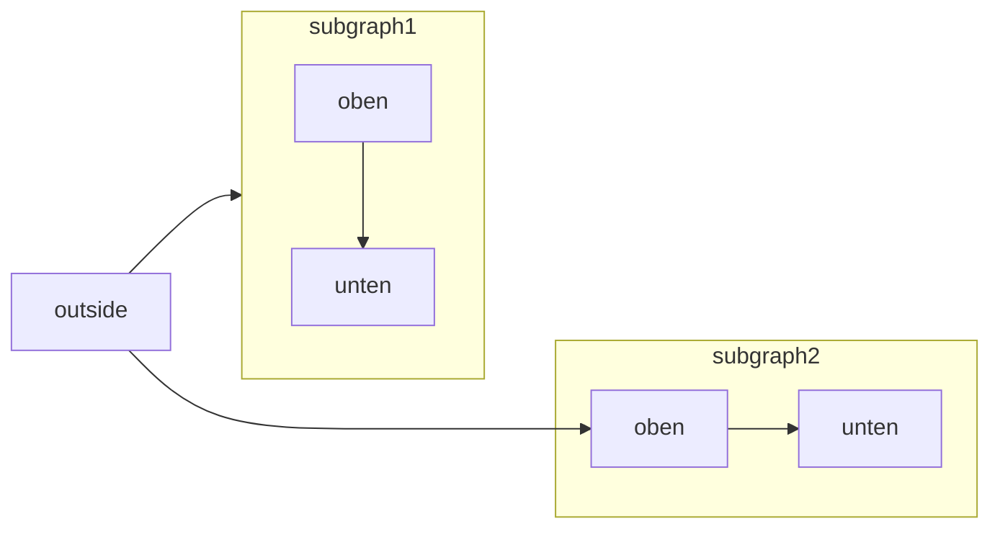

[Mermaid](https://mermaid.js.org/) ermöglicht es, Flussdiagramme, Sequenzdiagramme, Gantt-Diagramme und andere Diagramme mithilfe von Text und Code zu erstellen.

Eine vollständige Liste der unterstützten Diagrammtypen und der Syntax finden Sie in der [Mermaid-Dokumentation](https://mermaid.js.org/intro/).



````mdx Mermaid flowchart example

````


<div id="syntax">
  ## Syntax
</div>

Um ein Mermaid-Diagramm zu erstellen, schreiben Sie die Diagrammdefinition in einen Mermaid-Code-Block.

````mdx
```mermaid
// Ihr Mermaid-Diagramm-Code hier
```
````
